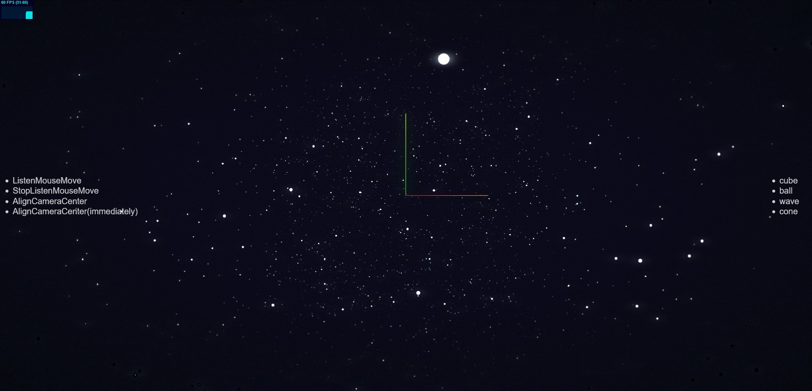

# Up2017-Particles-Effect-Template

## 前言

这是一个模仿 [UP2017腾讯互动娱乐年度发布会 - 腾讯互动娱乐](http://up.qq.com/act/a20170301pre/index.html#) 的页面模板

使用 React + Typescript + ThreeJs 制作


## 项目解析 + 实现过程

https://blog.shiinafan.top/posts/%E5%9F%BA%E4%BA%8EThreeJs%E5%AE%9E%E7%8E%B0%E7%9A%84%E7%BD%91%E9%A1%B53D%E7%B2%92%E5%AD%90%E6%95%88%E6%9E%9C%E7%BB%8F%E9%AA%8C%E5%88%86%E4%BA%AB/

## 使用本项目

### 克隆到本地

```bash
git clone https://github.com/QingXia-Ela/Up2017-Particles-Effect-Template.git
cd Up2017-Particles-Effect-Template
npm install
```

### 启动项目

```
npm run dev
```

### 基本体验

启动 dev 后就可以看到如下基本界面：



左侧部分是场景部分的 api，右侧是可变化的模型选择

核心使用部分位于 `src/pages/IndexPage/index.tsx` 下

## 项目核心部分

位于 `src/THREE` 下的 `index.ts` 文件是本项目的核心库，配套的部分声明文件在 `src/declare/THREE/index.ts` 下，常量文件在 `src/constant/THREE` 下

### 使用核心

模型列表

```ts
import { ParticleModelProps } from '@/declare/THREE'

const Models: ParticleModelProps[] = [
  // Your Code...
]

export default Models
```

组件内使用

```tsx
import ParticleSystem from '@/THREE'

let hasInit = false
function IndexPage() {
  const wrapper = useRef<HTMLDivElement | null>(null)

  useEffect(() => {
    if (!hasInit) {
      hasInit = true
      let MainParticle = new ParticleSystem({
        CanvasWrapper: wrapper.current,
        Models,
        onModelsFinishedLoad: (point) => {
          MainParticle?.ListenMouseMove()
        }
      })
    }
  })

  return (
    <div className={Styles.index_page}>
      <div className={Styles.canvas_wrapper} ref={wrapper}></div>
    </div>
  )
}
```

### 核心粒子实例 api

#### 举例使用

```ts
const m = new ParticleSystem({
    // ...
})

// 改变模型
m.ChangeModel('111', 2000)
```

#### constructor

接受一个对象，对象内参数如下：

| 参数名               | 类型                 | 备注                                                     |
| -------------------- | -------------------- | -------------------------------------------------------- |
| CanvasWrapper        | HTMLDivElement       | 需要将 `canvas` 插入到内部的目标元素                     |
| Models               | ParticleModelProps[] | 模型列表                                                 |
| addons               |                      | (可选) addons，他应该是一个继承了 `addonsBasic` 类的对象 |
| AnimateDuration      | number               | (可选) 粒子动画时间，默认 1500                           |
| onModelsFinishedLoad | Function             | (可选) 所有模型加载完成的回调                            |
| LoadingManager       | THREE.LoadingManager | (可选) 加载管理器，会被放入默认加载器进行处理            |

详细内容可以查看源码

#### ChangeModel

改变当前展示的模型

| 参数名 | 类型   | 备注                                                   |
| ------ | ------ | ------------------------------------------------------ |
| name   | string | 要切换的模型名字，如果指定名字的模型不存在则会抛出警告 |
| time   | number | (可选) 动画执行时长，实际表演时长为 `time * 2`         |

`time * 2` 的具体原因可以查看：https://tgideas.qq.com/gicp/news/475/6515254.html?from=list **切换动画** 部分

#### ListenMouseMove

开始监听鼠标移动的钩子，不接受参数，调用后场景会随着鼠标移动产生一个重力感的微小移动

#### StopListenMouseMove

停止监听鼠标移动的钩子，不接受参数

#### AlignCameraCenter

使场景归中，默认归中时是带有重力感的归中方式

| 参数名      | 类型    | 备注                                                         |
| ----------- | ------- | ------------------------------------------------------------ |
| immediately | boolean | 立即归中，默认为 `false`，启用后场景将立刻归中而不会带着富有重力感的移动模式 |

### ParticleModelProps 的配置使用

`ParticleModelProps ` 对象参数如下：

| 参数名                      | 类型                          | 备注                                         |
| --------------------------- | ----------------------------- | -------------------------------------------- |
| name                        | string                        | 模型名字                                     |
| geometry                    | (二选一) THREE.BufferGeometry | 自定义几何体，需要拥有 `position` attributes |
| path                        | (二选一) string               | 模型路径，内部使用 `OBJLoader` 进行加载      |
| loader                      | (可选) CustomLoader           | 自定义加载器，内容需自行前往 ts 声明文件查看 |
| NeedRemoveDuplicateParticle | (可选) boolean                | 是否需要进行粒子去重，默认为 `true`          |
| onLoadComplete              | (可选) Function               | 模型加载完成后的回调                         |
| onEnterStart                | (可选) Function               | 开始进入该模型时触发的回调                   |
| onEnterEnd                  | (可选) Function               | 模型切换完成时触发的回调                     |
| onAnimationFrameUpdate      | (可选) Function               | 动画帧更新时的回调                           |

详细内容可以前往 `src/declare/THREE/index.ts` 查看

其中 `geometry` 和 `path` 是二选一必填项。

### 关于 addons

这个制作的目标是解决氛围粒子的问题，由于本人 `ts`使用不熟练所以暂时用 `any[]` 进行替代，它原本应该是一个继承了 `addonsBasic` 的子类对象。

#### 使用方法

此处使用的例子是本模板自行编写的氛围例子

```ts
import { addonsBasic } from '../declare/THREE/addons'
class AtmosphereParticle extends addonsBasic {
    constructor() {
        super()
        // ...
    }
    
    update() {
        
    }
    
    ChangeModel() {
        
    }
}

const a = new AtmosphereParticle({
    // ...
})

// 使用
const m = new ParticleSystem({
    // ...
    addons: [a]
})
```

在 `addonsBasic` 下有两个函数钩子比较重要：

1. `update()` 当每一帧更新的时候调用的钩子
2. `ChangeModel()` 模型改变时触发的钩子

## License
[MIT](https://github.com/QingXia-Ela/Up2017-Particles-Effect-Template/blob/main/LICENSE) License
